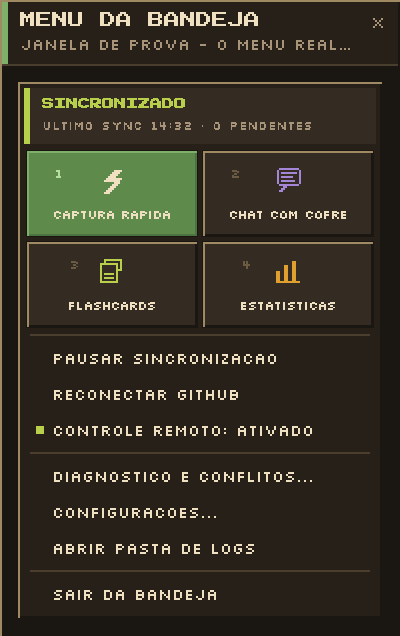
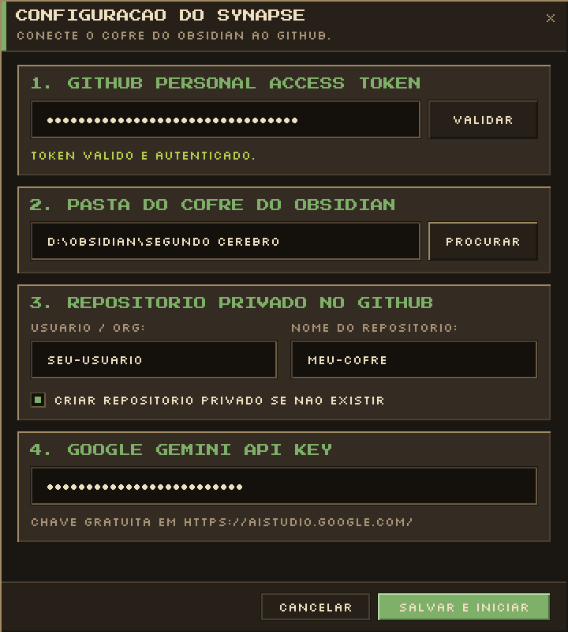
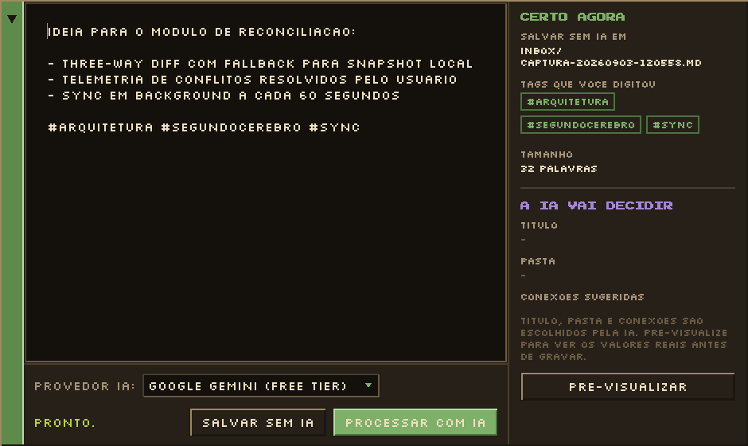
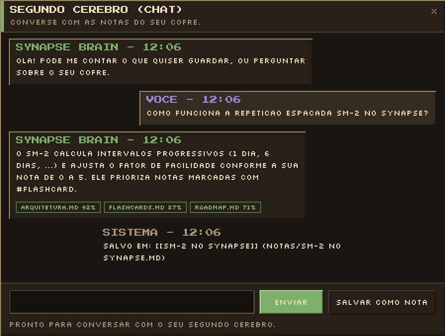
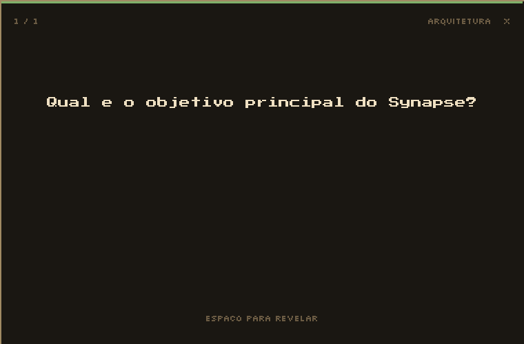
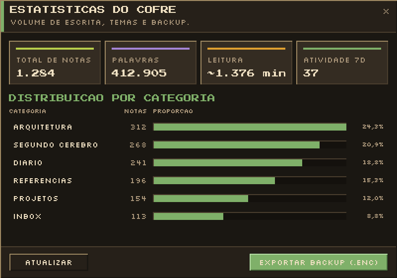
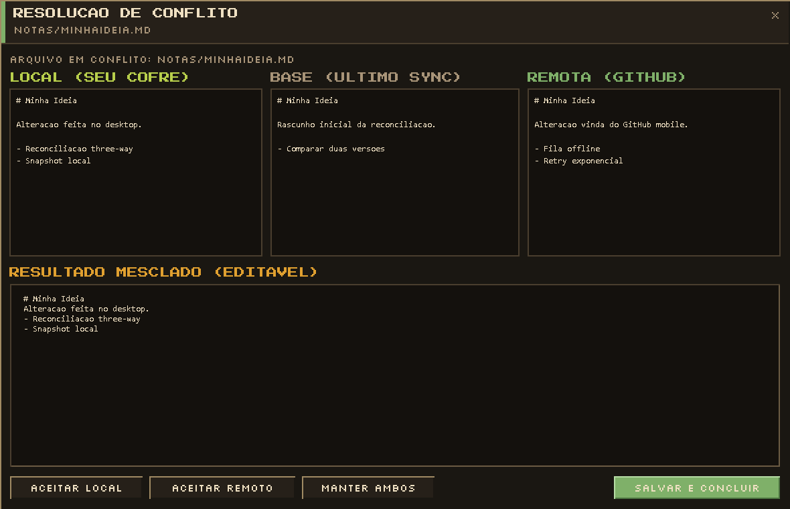
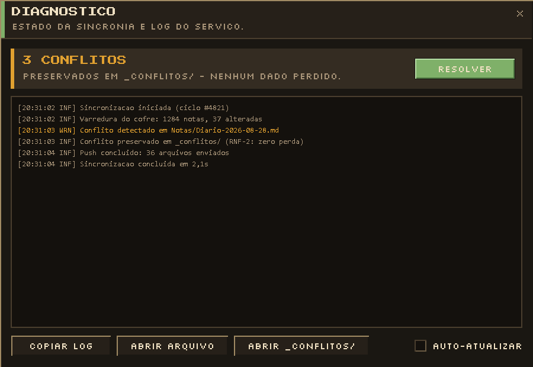
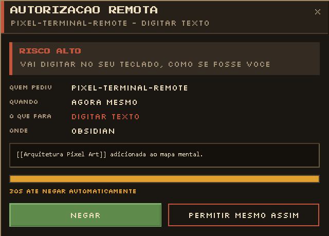

# Synapse

<p align="center">
  <strong>Seu cofre do Obsidian sincronizado num repositório privado do GitHub, com um segundo cérebro de IA em cima — rodando inteiro na sua máquina, a custo zero.</strong>
</p>

<p align="center">
  
  
  
  
  
  
</p>

<p align="center">
  
</p>

---

## O que é

O Synapse resolve dois problemas de uma vez para quem usa o Obsidian como segundo cérebro.

**Sincronizar sem pagar e sem entregar suas notas para terceiros.** Em vez de um serviço de
sincronização pago, o Synapse usa um repositório **privado e gratuito** do GitHub como backend.
Suas notas nunca passam por um servidor intermediário: o seu PC fala direto com a API do GitHub,
com o token guardado localmente e protegido pela **DPAPI** do Windows.

**Conversar com as próprias notas.** Um motor de RAG local indexa o cofre e permite perguntar em
linguagem natural — as respostas vêm com as notas de origem citadas em `[[wikilinks]]`, e o que
você escreve no chat pode virar nota estruturada automaticamente.

Tudo roda em segundo plano na sua máquina. Não existe servidor do Synapse, não existe conta do
Synapse, não existe telemetria.

---

## Como funciona

São dois processos que sobem juntos no seu login:

| Processo | Papel |
| :--- | :--- |
| `Synapse.Host` | Trabalho de fundo: observa o cofre, resolve conflitos, fila de sincronização, logs |
| `Synapse.Tray` | Interface na bandeja (WPF): captura, chat, flashcards, diagnóstico, configuração |

Os dois conversam por um **Named Pipe** (`\\.\pipe\synapse-ipc`) — o mesmo canal que o plugin do
Obsidian usa para mostrar o status de sincronização na barra de status do editor.

> **Nota de arquitetura:** o `Synapse.Host` **não** é um Windows Service, e isso é deliberado. A
> primeira versão era, e não funcionava: a DPAPI no modo `CurrentUser` cifra o token para a conta
> do usuário interativo, então o `LocalSystem` não conseguia decifrá-lo; e o Named Pipe recusava
> conexões de um processo de usuário comum por Mandatory Integrity Control. Hoje os dois
> processos sobem via `HKCU\...\Run` no login, o que de quebra dispensa privilégio de
> administrador.

---

## As telas

A interface é deliberadamente pixel-art 8-bit, renderizada em WPF com as fontes *Press Start 2P*
e *Silkscreen*, em escala inteira com Nearest Neighbor.

### Configuração inicial

Um assistente de quatro passos na primeira execução: token do GitHub (validado na hora), pasta do
cofre, repositório de destino (criado como privado se não existir) e a chave do Gemini — essa
última opcional, porque o Ollama local cobre o mesmo papel offline.

<p align="center">
  
</p>

### Captura rápida

Aberta pelo menu da bandeja, é onde a ideia entra crua. Você escreve, marca hashtags e decide:
salvar direto no `Inbox/` sem IA, ou deixar a IA escolher título, pasta e conexões. O painel da
direita separa o que é seu do que a IA vai decidir, com pré-visualização antes de gravar.

<p align="center">
  
</p>

### Chat com o cofre

Pergunta em linguagem natural sobre o conteúdo das notas. Cada resposta traz as fontes que a
sustentam, com nome do arquivo e grau de relevância. O botão *Salvar como nota* transforma a
conversa em nota estruturada dentro do cofre.

<p align="center">
  
</p>

### Revisão espaçada

Notas marcadas com `#flashcard` viram cartões. O agendamento usa **SM-2** — o mesmo algoritmo do
Anki — com intervalos progressivos e fator de facilidade ajustado pela sua nota de 0 a 5.

<p align="center">
  
</p>

### Estatísticas do cofre

Volume de escrita, distribuição por categoria, tempo estimado de leitura e atividade recente.
Também é o ponto de saída do backup criptografado (`.enc`).

<p align="center">
  
</p>

### Resolução de conflitos em 3 vias

Quando a mesma nota muda dos dois lados, o Synapse tenta o merge automático linha a linha. Se não
conseguir, abre o comparador com as três versões — local, base (último sync) e remota — mais o
resultado mesclado editável. **Nada é descartado:** o que não resolve automaticamente é preservado
em `_conflitos/`.

<p align="center">
  
</p>

### Diagnóstico

Estado da sincronia e o log do serviço em tempo real, colorido por severidade, com atalho direto
para a pasta de conflitos.

<p align="center">
  
</p>

### Synapse Remote — autorização no PC

O controle pelo celular exige confirmação humana na máquina para qualquer comando que digite ou
clique. O diálogo classifica o risco, diz exatamente o que vai acontecer e **nega por padrão**: no
timeout, ao fechar a janela, e mesmo quando nenhum diálogo está configurado.

<p align="center">
  
</p>

---

## Recursos

### Sincronização

- Repositório **privado e gratuito** do GitHub como backend, sem intermediário.
- Merge automático de 3 vias linha a linha (**DiffPlex**) e chave a chave no frontmatter YAML
  (**YamlDotNet**).
- Política de zero perda: conflito não resolvido vai para `_conflitos/`, nunca é sobrescrito.
- Observador do sistema de arquivos com debounce, fila persistida em SQLite e reconciliação
  periódica para o que escapar do watcher.
- `.synapseignore` com padrões glob no estilo `.gitignore`, e corte automático de anexos acima de
  50 MB.
- **Multi-cofre**: vários cofres isolados, cada um no seu repositório.

### Segundo cérebro

- **Provedor de IA plugável**: Google Gemini (`gemini-3.6-flash` por padrão, camada gratuita) ou
  **Ollama** local (`llama3.2:3b` + `nomic-embed-text`) para operação 100% offline. Se o primário
  falhar, o fallback assume automaticamente.
- **Busca híbrida**: FTS5 por palavra-chave (~2 ms) combinado com busca semântica por embeddings,
  fundidos por **Reciprocal Rank Fusion**. O índice vetorial é persistido, então só a primeira
  indexação custa tempo — as buscas seguintes carregam do disco sem rechamar a API de embeddings.
  O **ripgrep** vai embutido para varredura de texto bruto.
- Estruturação automática da nota: título, resumo, tags, categoria e pontos-chave.
- **Auto-linking**: conecta a nota nova ao que já existe no cofre via `[[wikilinks]]` e monta a
  seção de conexões relacionadas.
- Flashcards gerados a partir das notas, agendados por **SM-2**.
- Captura por voz transcrita pela IA.

### Synapse Remote

Controle o PC e consulte o cofre pelo celular, sem relay de terceiros — o canal de comando é o
próprio repositório do cofre, e uma PWA instalável fala direto com a API do GitHub.

- Seis comandos: `OpenApp`, `OpenNote`, `FocusWindow`, `TypeText`, `ClickElement`, `AskVault`.
- `OpenApp` é restrito a uma allowlist; `OpenNote` é protegido contra path traversal.
- `TypeText` usa `SendInput` com `KEYEVENTF_UNICODE` (nunca `SendKeys`); `ClickElement` usa UI
  Automation localizando o elemento **pelo nome**, nunca por coordenada de pixel.
- Confirmação humana obrigatória que nega por padrão, kill-switch verificado a cada comando
  (desligado por padrão) e trilha de auditoria de tudo que foi executado.
- Token dedicado, guardado separado do token de sincronização — perder o celular é revogar um
  token só.

### Segurança e privacidade

- Token do GitHub protegido por **DPAPI** (`CurrentUser`), nunca em texto plano.
- Criptografia opcional ponta a ponta do conteúdo antes do envio: **AES-256-GCM** com chave
  derivada por **PBKDF2** (100.000 iterações, SHA-256).
- Nenhum servidor do Synapse, nenhuma conta, nenhuma telemetria.

### Automação por regras

`.synapse/regras.yaml`, editável de dentro do próprio Obsidian, com recarga a quente:

- Nota diária automática com placeholders (`{{date}}`, `{{time}}`, `{{data:FORMATO}}`).
- Auto-tagging por termo ou por pasta.
- Reorganização de notas por status.

---

## Arquitetura do projeto

Arquitetura hexagonal (Ports & Adapters) em .NET 8 — o domínio não conhece GitHub, disco nem IA:

```
src/
├── Synapse.Core/       portas e modelos de domínio, sem dependência externa
├── Synapse.Data/       persistência SQLite (fila, índice de sync, conflitos)
├── Synapse.Conflict/   merge de 3 vias e frontmatter YAML
├── Synapse.Rules/      motor de regras com hot-reload
├── Synapse.Sync/       GitHub, DPAPI, cripto AES-GCM, watcher, .synapseignore, snapshots
├── Synapse.Search/     índice FTS5 + ripgrep embutido
├── Synapse.Brain/      RAG, provedores Gemini/Ollama, grafo, SM-2
├── Synapse.Agent/      Synapse Remote: executor, poller, auditoria, confirmação
├── Synapse.Host/       processo de fundo (worker + servidor IPC + Serilog)
└── Synapse.Tray/       interface WPF pixel-art na bandeja

plugins/obsidian-synapse/   plugin TypeScript de status para o Obsidian
packaging/inno/             instalador gráfico (Inno Setup)
packaging/winget/           manifestos do winget
tests/Synapse.Tests/        suíte de testes unitários, integração e E2E
```

---

## Instalação

### Instalador pronto

Baixe o `Synapse-Setup-*.exe` mais recente em
[Releases](https://github.com/VictorSilva-Desenvolvedor/Synapse/releases) e execute. Ele instala
os dois processos, registra o autostart no login e abre o assistente de configuração.

### A partir do código

**Pré-requisitos:** Windows 10 ou 11 (64 bits),
[.NET 8 SDK](https://dotnet.microsoft.com/download/dotnet/8.0), uma conta do GitHub com um
Personal Access Token de escopo `repo` e — opcionalmente — uma chave gratuita do
[Google AI Studio](https://aistudio.google.com/).

```powershell
git clone https://github.com/VictorSilva-Desenvolvedor/Synapse.git
cd Synapse

dotnet test                                               # roda a suíte
dotnet run --project src/Synapse.Tray/Synapse.Tray.csproj # sobe a bandeja
```

Na primeira execução o assistente de configuração abre sozinho.

Para gerar o instalador localmente (requer Inno Setup):

```powershell
powershell -File scripts/build-installer.ps1
```

---

## Desenvolvimento

```powershell
dotnet test --configuration Release   # suíte completa
dotnet format --verify-no-changes     # o mesmo gate de formatação do CI
```

As capturas deste README são geradas por teste, não tiradas à mão — `WpfCaptureTests` renderiza
cada janela com `RenderTargetBitmap` a 96 DPI fixo, então o resultado não depende do monitor:

```powershell
powershell -File scripts/capture-ui.ps1                         # todas as telas
powershell -File scripts/capture-ui.ps1 -Screen ChatVaultWindow # uma só
```

Convenções de commit, checklist antes de commitar e critérios de CI estão em
[CONTRIBUTING.md](CONTRIBUTING.md).

---

## Licença

MIT — veja [LICENSE](LICENSE).
