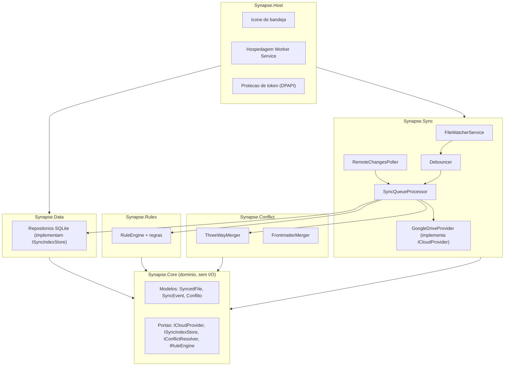
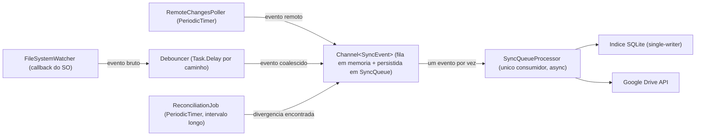
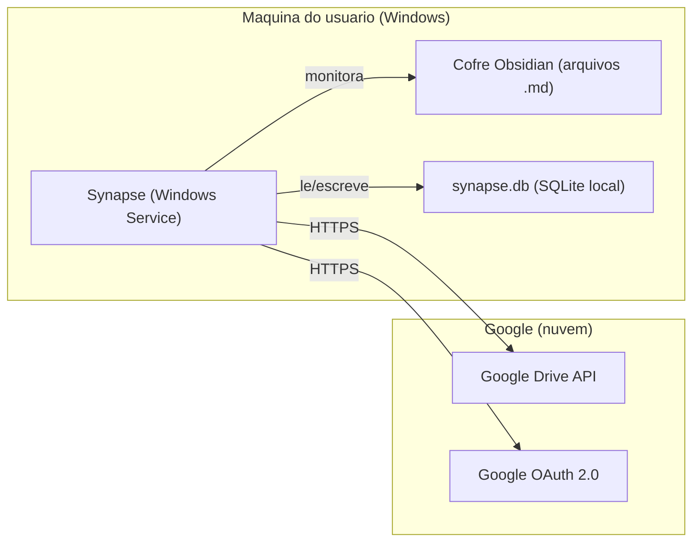

# SAD — Documento de Arquitetura de Software: Synapse

*Versão 1.0 · 26/08/2026*
*Baseado em: `Visão de Produto - Synapse.md` (v2.1), `PRD - Synapse.md` (v1.0), `SRS - Synapse.md` (v1.0) e `Backlog - Synapse.md` (v1.0)*
*Estrutura adaptada do modelo de visões 4+1 (Kruchten), com Registro de Decisões Arquiteturais (ADR)*

---

## 1. Introdução

### 1.1 Propósito

Este documento formaliza a arquitetura de software do Synapse. Os documentos anteriores já continham decisões arquiteturais espalhadas (interface `ICloudProvider` no PRD, esquema de dados e namespaces no SRS); o SAD consolida essas decisões em visões coerentes, adiciona o que ainda não tinha sido especificado — principalmente o **modelo de concorrência** — e registra formalmente o porquê de cada decisão relevante (seção 9, ADRs).

### 1.2 Escopo

Cobre a arquitetura da v1 do Synapse (MVP + V1 + V2 do roadmap, ou seja, tudo que está no Backlog atual). V3/V4 (IA, multi-provedor ativo, E2E) não têm arquitetura detalhada aqui — apenas os pontos de extensão que a arquitetura atual já deixa preparados para elas.

### 1.3 Referências

`Visão de Produto - Synapse.md`, `PRD - Synapse.md`, `SRS - Synapse.md`, `Backlog - Synapse.md` (todos no mesmo repositório).

### 1.4 Direcionadores Arquiteturais

Os requisitos que mais pressionam a forma da arquitetura (nem todo RNF pressiona igual — estes são os que efetivamente moldam decisões estruturais):

| Direcionador | Origem | Implicação arquitetural |
|---|---|---|
| Zero perda silenciosa de dado | RNF-2 | Escrita local atômica; toda operação de risco passa por fila persistida antes de ser considerada "em andamento" |
| Eficiência de cota da API | RNF-3 | Índice local como cache de verdade; nunca decidir "o que sincronizar" perguntando ao Drive |
| Extensibilidade de provedor de nuvem | RNF-6 | Toda comunicação externa isolada atrás de uma porta (`ICloudProvider`), não chamada direta de SDK no núcleo |
| Nenhum servidor operado pelo projeto | Visão de Produto, diferencial "custo zero" | Deployment de nó único; nenhuma dependência de infraestrutura backend própria |
| Testabilidade / lógica sem I/O | Backlog, DoD (toda lógica nova precisa de teste unitário) | Núcleo de domínio livre de I/O direto, testável com dublês |

---

## 2. Estilo Arquitetural

**Estilo adotado: Arquitetura Hexagonal (Ports & Adapters), com um pipeline orientado a eventos internamente.**

- O **núcleo de domínio** (`Synapse.Core` + a lógica de negócio de `Synapse.Sync`/`Conflict`/`Rules`) não depende de nenhuma infraestrutura concreta — apenas de interfaces ("portas"): `ICloudProvider`, `ISyncIndexStore`, `IConflictResolver`, `IRuleEngine`.
- Infraestrutura concreta (Google Drive API, SQLite, sistema de arquivos, bandeja do Windows) entra como **adaptadores** que implementam essas portas, isolados em `Synapse.Data` e `Synapse.Host`.
- Internamente, componentes se comunicam por **eventos** publicados em um canal único (`Channel<SyncEvent>` do .NET), não por chamadas diretas encadeadas — isso desacopla produtores de eventos (watcher local, poller remoto, reconciliação) do único consumidor que efetivamente aplica mudanças.

Por que esse estilo e não outro mais simples (ex.: camadas tradicionais chamando diretamente)? Ver **ADR-001**.

---

## 3. Visão Lógica (Componentes)



**Regra de dependência (reforça RNF-6):** setas sempre apontam para dentro, em direção a `Synapse.Core`. `Core` nunca depende de `Sync`, `Data` ou `Host`. Essa regra é o que torna possível trocar `GoogleDriveProvider` por um futuro `OneDriveProvider` sem tocar no núcleo — é a base técnica que sustenta a promessa de extensibilidade multi-provedor da Visão de Produto (item V4).

### 3.1 Responsabilidade por componente

| Componente | Responsabilidade | Depende de |
|---|---|---|
| `Synapse.Core` | Modelos de domínio e portas (interfaces); zero I/O | Nada |
| `Synapse.Sync` | Orquestração: watcher, debounce, fila, polling remoto, adaptador concreto do Google Drive | `Core` |
| `Synapse.Conflict` | Algoritmos de merge (puros, sem I/O) | `Core` |
| `Synapse.Rules` | Motor de regras e implementações de regra | `Core` |
| `Synapse.Data` | Persistência SQLite (índice, fila, conflitos, estado) | `Core` |
| `Synapse.Host` | Composição/DI, hospedagem como serviço, bandeja, DPAPI | `Sync`, `Conflict`, `Rules`, `Data` |
| `Synapse.Tests` | Testes unitários, principalmente de `Conflict` e `Rules` (lógica pura) | Todos (referência de teste) |

---

## 4. Visão de Processos (Modelo de Concorrência)

Este é o conteúdo mais novo em relação aos documentos anteriores — o SRS descreveu o *comportamento* (máquina de estados) mas não *quem executa o quê em paralelo*.

**Princípio adotado: um único consumidor serializa toda escrita no índice local.** Múltiplos produtores publicam eventos; um único processador de fila os aplica em ordem. Isso elimina a necessidade de locks complexos no SQLite (que é single-writer por natureza) sem sacrificar responsividade — é a solução mais simples que resolve o problema (KISS), preferida a um modelo com múltiplas threads escrevendo no índice sob lock.



- **FileWatcherService**: callback do `FileSystemWatcher` só enfileira o evento bruto — nunca faz I/O de rede ou disco pesado dentro do callback do SO (evitar bloquear o watcher, risco documentado no SRS de perda de eventos sob carga).
- **Debouncer**: um `Task.Delay` cancelável por caminho de arquivo; só publica no canal quando a janela de silêncio (2000ms padrão) expira.
- **RemoteChangesPoller**: `PeriodicTimer` independente, não compete por I/O local, só publica eventos remotos no mesmo canal.
- **ReconciliationJob** (item `TECH-01` do Backlog): roda em intervalo bem mais longo, também só publica no canal — não acessa o índice diretamente.
- **SyncQueueProcessor**: único `await foreach` consumindo o canal — é o único ponto que escreve no índice SQLite e chama `ICloudProvider`. Processamento é sequencial por padrão (simplicidade > paralelismo agressivo, já que o gargalo real é a rede, não a CPU).
- **Token refresh** (RF-AUTH.3): não é uma thread própria — é uma verificação feita dentro do `GoogleDriveProvider` antes de cada chamada, mantendo o modelo de concorrência simples (menos uma fonte de corrida a considerar).

Ver **ADR-007** para a decisão de canal único vs. filas paralelas por tipo de evento.

---

## 5. Visão de Implantação



Um único nó de execução: a máquina do usuário. Não há nó de servidor operado pelo projeto — reforça o diferencial "custo zero de infraestrutura" da Visão de Produto. Se o usuário sincroniza dois computadores, cada um roda sua própria instância do Synapse, e o Google Drive é o único ponto de encontro entre eles (não há comunicação direta entre instâncias).

---

## 6. Visão de Implementação

Estrutura de solução .NET (mapeamento direto da visão lógica, seção 3):

```
Synapse.sln
├── src/
│   ├── Synapse.Core/       (sem dependências externas)
│   ├── Synapse.Sync/       → depende de Synapse.Core
│   ├── Synapse.Conflict/   → depende de Synapse.Core
│   ├── Synapse.Rules/      → depende de Synapse.Core
│   ├── Synapse.Data/       → depende de Synapse.Core
│   └── Synapse.Host/       → depende de todos acima (composição/DI)
└── tests/
    └── Synapse.Tests/      → referencia todos os projetos de src/
```

A regra de dependência da seção 3 deve ser verificável: nenhuma referência de projeto de `Synapse.Core` para qualquer outro projeto do `src/`. Isso pode (e deveria, quando o time crescer além de uma pessoa) virar um teste de arquitetura automatizado — não é bloqueante para o MVP, mas é registrado aqui como prática recomendada.

---

## 7. Visão de Dados

O esquema completo já está especificado no SRS (seção 3.3: `SyncedFiles`, `SyncQueue`, `Conflicts`, `SyncState`). O SAD acrescenta o **ciclo de vida** do dado através da arquitetura:

1. Arquivo salvo no cofre → `FileWatcherService` detecta → evento no `Channel`.
2. `SyncQueueProcessor` calcula hash, compara com `SyncedFiles` (via `ISyncIndexStore`).
3. Se mudou: chama `ICloudProvider.UploadAsync` (implementado por `GoogleDriveProvider`), depois atualiza `SyncedFiles` com o novo hash/revisão.
4. Se o mesmo arquivo também mudou remotamente desde a última sincronização: delega para `IConflictResolver` antes do passo 3.
5. Toda transição de estado do arquivo (`Status` em `SyncedFiles`) é persistida antes de a operação de rede ser confirmada como concluída — garante que uma queda no meio do processo deixe o dado em um estado consistente e retomável, não corrompido.

---

## 8. Requisitos de Qualidade × Mecanismo Arquitetural

| RNF | Mecanismo arquitetural que o atende |
|---|---|
| RNF-1 (performance) | Debounce configurável + processamento assíncrono não bloqueante no `SyncQueueProcessor` |
| RNF-2 (confiabilidade / zero perda) | Fila persistida em SQLite antes de qualquer operação de rede; escrita local atômica (arquivo temporário + rename) |
| RNF-3 (cota) | Índice local como cache de verdade (RF-SYNC.3) evita perguntar ao Drive o que já se sabe; `changes.list` incremental |
| RNF-4 (segurança) | Token protegido via DPAPI no `Synapse.Host`; escopo `drive.file` limita o raio de ação do `GoogleDriveProvider` |
| RNF-5 (resiliência de rede) | `RemoteChangesPoller` e `SyncQueueProcessor` toleram falha de rede sem encerrar; retomam via fila persistida |
| RNF-6 (extensibilidade) | `ICloudProvider` como porta; `Synapse.Core` sem dependência de infraestrutura (arquitetura hexagonal, seção 2) |
| RNF-7 (portabilidade) | Único ponto com API específica de Windows é `Synapse.Host` (DPAPI, Windows Service, bandeja); núcleo e `Sync`/`Conflict`/`Rules`/`Data` são portáveis |
| RNF-8 (observabilidade) | Cada componente da visão de processos (seção 4) loga em pontos de transição, não só em erro |

---

## 9. Registro de Decisões Arquiteturais (ADRs)

> **Nota (26/08/2026):** as ADRs abaixo foram movidas para `ADR - Synapse.md`, que passa a ser o **registro vivo** (inclui também a ADR-009, com a restrição permanente de "gratuito, sem assinatura, sem cartão", e a auditoria de conformidade de cada decisão). A lista abaixo permanece como snapshot histórico da v1.0 deste SAD; para o estado atual, consultar sempre o arquivo dedicado.

### ADR-001 — Arquitetura Hexagonal (Ports & Adapters)

- **Status:** Aceita
- **Contexto:** o núcleo de sincronização precisa ser testável sem rede real (DoD do Backlog exige teste unitário para toda lógica nova) e extensível para outros provedores de nuvem no futuro (V4 da Visão de Produto).
- **Decisão:** isolar toda infraestrutura (Google Drive, SQLite, sistema de arquivos, bandeja) atrás de interfaces definidas em `Synapse.Core`, nunca referenciadas em sentido inverso.
- **Consequências:** mais um nível de indireção do que uma chamada direta ao SDK do Google — aceito conscientemente pelo ganho em testabilidade e extensibilidade.
- **Alternativas consideradas:** arquitetura em camadas simples chamando o SDK do Google diretamente do motor de sync — mais simples de escrever, mas acopla o núcleo à infraestrutura e dificulta os testes unitários exigidos pela DoD.

### ADR-002 — SQLite como armazenamento local

- **Status:** Aceita
- **Contexto:** era preciso escolher entre SQLite e LiteDB para o índice local (pergunta que já aparecia como decisão a tomar no PRD).
- **Decisão:** SQLite via `Microsoft.Data.Sqlite`.
- **Consequências:** exige um driver relacional (leve) em vez de um banco de documentos embutido puro-.NET; em troca, ganha-se ferramentas de inspeção amplamente conhecidas (DB Browser for SQLite) para depuração manual do usuário técnico-alvo.
- **Alternativas consideradas:** LiteDB — mais simples de embutir (zero dependência nativa), mas com ecossistema de ferramentas de inspeção menor; descartado em favor de inspecionabilidade.

### ADR-003 — Escopo OAuth `drive.file`

- **Status:** Aceita
- **Contexto:** o escopo `drive` completo dá acesso a todo o Drive do usuário e é classificado como sensível pelo Google, exigindo processo de verificação de app.
- **Decisão:** usar exclusivamente `drive.file`, que só permite acesso a arquivos criados pelo próprio app ou explicitamente selecionados pelo usuário.
- **Consequências:** evita fricção de verificação do Google e o cap de 100 usuários de teste; em troca, força uma primeira sincronização feita pelo app (não pode simplesmente "ver" uma pasta pré-populada manualmente sem o usuário selecioná-la explicitamente) — risco já registrado no PRD (spike `TECH-05`).
- **Alternativas consideradas:** escopo `drive` completo — rejeitado pelo custo de verificação e pela superfície de acesso desnecessariamente ampla (viola princípio de menor privilégio).

### ADR-004 — `changes.list` incremental em vez de varredura completa recorrente

- **Status:** Aceita
- **Contexto:** decidir como detectar mudanças remotas sem estourar cota nem reimplementar lógica de diff do zero.
- **Decisão:** usar o endpoint `changes.list` da própria Google Drive API com `pageToken` persistido, restringindo campos retornados via parâmetro `fields`.
- **Consequências:** exige guardar e tratar corretamente o `pageToken` (estado adicional em `SyncState`); em troca, custo de cota ordens de grandeza menor que listagem completa recorrente.
- **Alternativas consideradas:** varredura completa periódica — descartada por custo de cota e por não escalar com o tamanho do cofre.

### ADR-005 — Merge de 3 vias local, sem servidor de sincronização

- **Status:** Aceita
- **Contexto:** o Self-hosted LiveSync (concorrente estudado na Visão de Produto) resolve conflitos de forma madura, mas depende de hospedar um servidor CouchDB.
- **Decisão:** implementar o merge de 3 vias como lógica pura em `Synapse.Conflict`, rodando localmente, usando a última versão sincronizada conhecida (guardada no índice) como base do merge — sem precisar de um servidor externo de resolução.
- **Consequências:** a qualidade do merge depende inteiramente da lógica implementada localmente (sem o benefício de um motor de sincronização de documentos já maduro como o CouchDB); em troca, mantém a promessa central do produto — "zero servidor para manter".
- **Alternativas consideradas:** delegar a um CouchDB (como o LiveSync) — rejeitado por contradizer o diferencial central do produto frente a essa concorrência específica.

### ADR-006 — Worker Service / Windows Service como modelo de hospedagem

- **Status:** Aceita
- **Contexto:** o produto precisa rodar continuamente em background, sobrevivendo a reinício do computador, para um usuário técnico.
- **Decisão:** hospedar como .NET Worker Service registrável como Windows Service, com bandeja de sistema para status/controle, sem janela principal na v1.
- **Consequências:** instalação exige privilégio administrativo (registro de serviço) — aceitável para o público-alvo técnico da v1; uma GUI completa fica fora de escopo (já registrado no PRD).
- **Alternativas consideradas:** aplicativo com janela sempre aberta — rejeitado por não bater com o modelo de "roda sozinho em background" esperado pelo usuário-alvo.

### ADR-007 — Canal único de eventos com consumidor serializado

- **Status:** Aceita
- **Contexto:** múltiplas fontes de evento (watcher local, poller remoto, reconciliação) precisam escrever no mesmo índice SQLite sem condição de corrida.
- **Decisão:** todos os produtores publicam em um único `Channel<SyncEvent>`; um único consumidor assíncrono processa em ordem.
- **Consequências:** processamento é sequencial, não paralelo — aceitável porque o gargalo real é a latência de rede da API do Google, não a CPU local; simplifica drasticamente o modelo de concorrência (sem locks explícitos no índice).
- **Alternativas consideradas:** filas paralelas por tipo de evento com locks no índice — rejeitada por complexidade desnecessária frente ao volume de eventos esperado (uso pessoal, não multiusuário concorrente).

### ADR-008 — DPAPI para proteção de credenciais

- **Status:** Aceita
- **Contexto:** o `refresh_token` OAuth não pode ficar em texto plano em disco (RNF-4).
- **Decisão:** usar `System.Security.Cryptography.ProtectedData` (DPAPI do Windows, escopo `CurrentUser`) em vez de implementar criptografia própria.
- **Consequências:** amarra a proteção de credencial à conta do Windows do usuário (não portável entre máquinas sem novo login, o que é aceitável — cada instância já faz seu próprio OAuth); evita o risco de reinventar criptografia mal.
- **Alternativas consideradas:** criptografia simétrica própria com chave derivada de senha — rejeitada por adicionar superfície de risco (gestão de chave) sem necessidade, quando o SO já oferece um mecanismo adequado.

---

## 10. Riscos Arquiteturais e Débito Técnico Aceito

| Risco/débito | Descrição | Aceito porque |
|---|---|---|
| Nó único de execução | Se a máquina do usuário falhar irrecuperavelmente entre sincronizações, alterações não sincronizadas podem se perder | Coerente com o modelo "sem servidor"; mitigado por RF-SYNC.4 (fila persistida) e pela própria natureza do Google Drive como backup externo assim que sincronizado |
| Processamento sequencial no `SyncQueueProcessor` | Sob volume muito alto de eventos simultâneos, o processamento pode enfileirar e atrasar | Aceito no MVP pelo volume esperado (uso pessoal); documentado como ponto de atenção se o produto crescer para uso mais intenso |
| Dependência do `FileSystemWatcher` do Windows | API do SO com limitação conhecida de buffer sob carga alta | Mitigado arquiteturalmente pelo `ReconciliationJob` (TECH-01) como rede de segurança, não eliminado — débito técnico aceito conscientemente |
| Ausência de teste de arquitetura automatizado para a regra de dependência (seção 6) | A regra "Core não depende de nada" é hoje apenas convenção, não verificada por ferramenta | Aceitável para um projeto solo no MVP; registrado como melhoria futura, não bloqueante |

---

*Este SAD deve ser atualizado sempre que uma decisão arquitetural for revista — cada ADR revisado ganha um novo registro com status "Substituída por ADR-xxx", nunca é editado silenciosamente por cima.*
