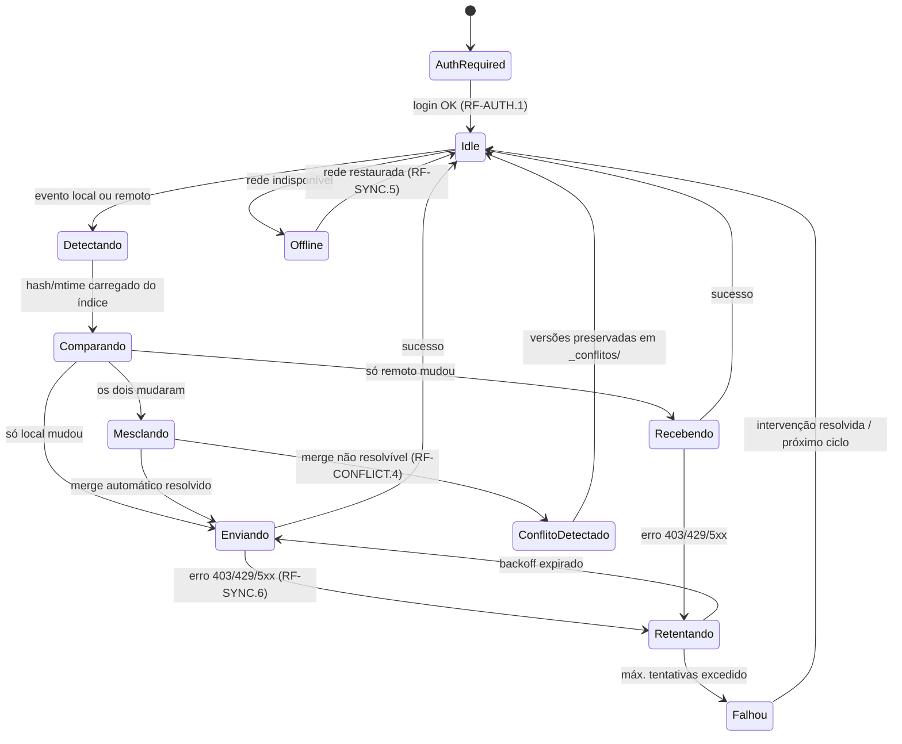

# SRS — Especificação de Requisitos de Software: Synapse

*Versão 1.0 · 26/08/2026*
*Baseado em: `Visão de Produto - Synapse.md` (v2.1) e `PRD - Synapse.md` (v1.0)*
*Estrutura adaptada do padrão IEEE 830 / ISO/IEC/IEEE 29148*

---

## 1. Introdução

### 1.1 Propósito

Este documento especifica os requisitos de software do **Synapse**, em nível técnico suficiente para orientar implementação e teste. Ele **não redefine** os requisitos já priorizados no PRD — reutiliza os mesmos identificadores (`RF-x`, `RNF-x`) e os detalha tecnicamente: entradas, processamento, saídas, exceções, interfaces externas, esquema de dados e atributos de qualidade mensuráveis.

Público-alvo: quem for implementar, revisar código ou escrever testes do Synapse (inicialmente, o próprio autor do projeto).

### 1.2 Escopo

O software especificado é um serviço em background (C#/.NET) para Windows que:
1. Sincroniza um cofre Obsidian local com uma pasta no Google Drive.
2. Resolve conflitos de edição concorrente com merge de 3 vias.
3. Executa automações configuráveis sobre as notas (motor de regras).

Fora do escopo deste SRS: os itens listados na seção 3 do PRD ("Fora de Escopo da v1") — mobile nativo, criptografia E2E, multi-provedor de nuvem ativo, GUI rica, múltiplos cofres simultâneos, linkagem inteligente por IA.

### 1.3 Definições, Acrônimos e Abreviações

| Termo | Definição |
|---|---|
| Vault (cofre) | Pasta raiz de um cofre Obsidian, contendo notas `.md` e anexos |
| PKM | Personal Knowledge Management |
| Frontmatter | Bloco YAML no início de uma nota Markdown, delimitado por `---`, com metadados |
| Debounce | Técnica para agrupar eventos disparados em rajada em um único evento processado |
| OAuth 2.0 / PKCE | Protocolo de autorização; PKCE é a extensão que dispensa segredo de cliente embutido, adequada para apps desktop |
| Quota unit | Unidade de custo de cada chamada à Google Drive API, usada para calcular limites de uso |
| Change token (`pageToken`) | Cursor opaco retornado pela Google Drive API para retomar a leitura incremental de mudanças |
| DPAPI | Data Protection API do Windows, usada para criptografar dados em repouso vinculados ao usuário/máquina |
| MTBF | Mean Time Between Failures (tempo médio entre falhas) |

### 1.4 Referências

- `Visão de Produto - Synapse.md` v2.1 (mercado, concorrência, arquitetura de alto nível)
- `PRD - Synapse.md` v1.0 (objetivos, personas, RF-x/RNF-x, fases)
- [Google Drive API — usage limits](https://developers.google.com/workspace/drive/api/guides/limits)
- [Self-hosted LiveSync — resolução de conflitos](https://deepwiki.com/vrtmrz/obsidian-livesync/4.2-conflict-resolution)

### 1.5 Visão Geral do Documento

Seção 2 descreve o produto em nível de sistema. Seção 3 contém os requisitos específicos (o núcleo técnico do SRS). Seção 4 traz a matriz de rastreabilidade. Os apêndices trazem glossário estendido e um esboço de arquitetura de componentes para orientar a organização do código.

---

## 2. Descrição Geral

### 2.1 Perspectiva do Produto

O Synapse é um sistema novo e autônomo (não é módulo de outro sistema maior). Ele se conecta a dois sistemas externos que não controla:

```
┌────────────────────┐        ┌──────────────────────┐        ┌────────────────────┐
│  Obsidian (app)     │        │   Synapse (serviço)   │        │  Google Drive API   │
│  cofre local .md    │◄──────►│  Watcher / Índice /   │◄──────►│  pasta remota do    │
│  (filesystem)       │        │  Motor de Sync/Regras │        │  usuário (Google One)│
└────────────────────┘        └──────────────────────┘        └────────────────────┘
```

O Synapse não modifica o Obsidian nem depende de nenhum plugin dele — opera inteiramente no sistema de arquivos por fora do app.

### 2.2 Funções do Produto (resumo)

Ver PRD seção 5 para a lista completa. Resumidamente: monitorar o cofre local, autenticar e falar com o Google Drive, manter um índice de sincronização, detectar e resolver conflitos, aplicar regras de automação, e expor status via bandeja de sistema.

### 2.3 Características dos Usuários

Usuário técnico único (dev/power user), confortável instalando e operando um serviço de background em Windows. Não é necessário desenhar para usuários não técnicos nesta versão (ver PRD, Fora de Escopo).

### 2.4 Restrições

- Linguagem/plataforma: C#, .NET (versão LTS mais recente disponível no início da implementação).
- Sistema operacional da v1: Windows 10/11 (RNF-7).
- Deve operar dentro das cotas gratuitas da Google Drive API (RNF-3) — nenhuma dependência de plano pago do Google Cloud.
- Escopo OAuth restrito a `drive.file` (RF-AUTH.1) — não pode requisitar escopo `drive` completo.

### 2.5 Suposições e Dependências

- Assume-se que o usuário já possui conta Google com espaço disponível no Google One.
- Assume-se conectividade intermitente, não permanente (o sistema deve ser projetado para offline-first, não apenas tolerar exceções de rede).
- Depende do pacote oficial `Google.Apis.Drive.v3` (NuGet) para comunicação com a API.
- Depende do `System.IO.FileSystemWatcher` do .NET para monitoramento local — ver limitação conhecida na seção 3.8.

---

## 3. Requisitos Específicos

### 3.1 Requisitos Funcionais (especificação técnica)

Cada item abaixo detalha tecnicamente o requisito correspondente já priorizado no PRD (mesmo ID `RF-x`).

**RF-AUTH.1 — Autenticação OAuth 2.0**
- Fluxo: Authorization Code + PKCE, executado via navegador do sistema (`System.Diagnostics.Process.Start` para a URL de consulta) e um listener HTTP local temporário (`http://localhost:<porta>/callback`) para capturar o código de autorização.
- Escopo solicitado: exatamente `https://www.googleapis.com/auth/drive.file`, nenhum escopo adicional.
- Armazenamento do token: `refresh_token` persistido criptografado via **DPAPI** (`System.Security.Cryptography.ProtectedData`, escopo `CurrentUser`), nunca em texto plano em disco ou em log.
- Exceção: se o usuário negar o consentimento, o sistema deve informar isso na bandeja e permanecer em estado "não configurado" sem tentar novamente automaticamente.

**RF-AUTH.3 — Renovação de token**
- O `access_token` deve ser renovado via `refresh_token` a cada requisição cujo token esteja a menos de 5 minutos de expirar (verificação proativa, não reativa a erro 401).
- Se a renovação falhar (refresh token revogado/expirado), o sistema entra em estado `AuthRequired` e sinaliza na bandeja, sem derrubar o serviço.

**RF-SYNC.1 — Monitoramento local**
- `FileSystemWatcher` configurado com `NotifyFilter = LastWrite | FileName | DirName`, `IncludeSubdirectories = true`, filtro `*.md` mais lista configurável de extensões de anexo.
- Debounce: eventos do mesmo caminho de arquivo agrupados em uma janela deslizante de 2000ms (configurável), usando um `Dictionary<string, Timer>` ou equivalente — implementação deve evitar condição de corrida entre o timer de debounce e um novo evento chegando durante o processamento.

**RF-SYNC.2 — Detecção de mudanças remotas**
- Uso de `changes.list` com o `pageToken` obtido de `changes.getStartPageToken` na primeira execução, e persistido (tabela `SyncState`, ver 3.3) a cada ciclo bem-sucedido.
- Parâmetro `fields` da requisição deve ser restringido ao mínimo necessário (`nextPageToken, newStartPageToken, changes(fileId, file(name, modifiedTime, md5Checksum, parents, trashed))`), reduzindo custo de payload e cota.
- Intervalo de polling do `changes.list`: configurável, padrão 60s quando não há push notification ativa (webhook do Drive é item Should, não Must, na v1).

**RF-SYNC.3 — Índice local**
- Ver esquema completo na seção 3.3 (`SyncedFiles`). Toda decisão de "o arquivo mudou?" compara hash SHA-256 do conteúdo local contra o valor armazenado, não apenas `mtime` (evita falso positivo por toque de arquivo sem mudança de conteúdo).

**RF-SYNC.4 — Fila persistida**
- Fila implementada como tabela `SyncQueue` (SQLite) em vez de fila em memória — garante sobrevivência a kill do processo. Cada linha é removida somente após confirmação de sucesso da operação correspondente.

**RF-SYNC.6 — Backoff exponencial**
- Erros HTTP 403 (com motivo `rateLimitExceeded` ou `userRateLimitExceeded`) e 429: retry com backoff exponencial + jitter, base 1s, fator 2, teto de 60s, máximo de 8 tentativas antes de marcar o item como `Failed` e alertar via log/bandeja.
- Erros 5xx: mesma política de retry.
- Erros 401: dispara fluxo de renovação de token (RF-AUTH.3) antes de tentar novamente, sem contar como tentativa de backoff.

**RF-CONFLICT.1–2 — Detecção e merge de 3 vias**
- Conflito real = quando `SyncedFiles.LocalMtime` E o `modifiedTime` remoto avançaram, ambos, desde `LastSyncedAt`.
- Merge de 3 vias usa como "base" o conteúdo salvo no índice local no momento do último sync bem-sucedido (deve ser cacheado localmente, não recuperado do Drive a cada merge, para não gastar cota). Algoritmo: diff da base contra local e da base contra remoto; se os hunks não se sobrepõem, aplica ambos; se sobrepõem, cai em RF-CONFLICT.4.

**RF-CONFLICT.3 — Merge de frontmatter**
- Frontmatter é parseado isoladamente do corpo (delimitadores `---`) antes do merge de texto. Merge é por chave: chave alterada só de um lado é aplicada; chave alterada dos dois lados com valores diferentes é tratada como conflito de chave (vai para RF-CONFLICT.4 mesmo que o corpo tenha sido resolvido automaticamente).

**RF-CONFLICT.4 — Preservação garantida**
- Ao detectar conflito não resolvível, grava dois arquivos em `_conflitos/<caminho-original>/`: `local-<timestamp>.md` e `remoto-<timestamp>.md`. O arquivo original em sua localização normal mantém a última versão sincronizável (nunca fica órfão ou vazio).

**RF-RULES.1 — Config de regras**
- Arquivo `.synapse/regras.yaml` na raiz do cofre, recarregado via `FileSystemWatcher` dedicado (mudança no arquivo de regras aplica-se sem reiniciar o serviço).
- Formato de cada regra: `tipo`, `condição` (opcional), `ação`, `parâmetros` — ver exemplo no Apêndice B.

**RF-UX.1/UX.3 — Bandeja e execução como serviço**
- Ícone de bandeja com 4 estados visuais distintos (Sincronizado / Sincronizando / Offline / Erro), atualizado via evento interno publicado pelo `SyncEngine`.
- Hospedagem via .NET **Worker Service** registrado como Windows Service (`sc.exe create` ou instalador), com `Environment.UserInteractive` usado para alternar entre modo serviço (produção) e console (debug local).

### 3.2 Requisitos de Interface Externa

#### 3.2.1 Interfaces de Usuário
- Ícone de bandeja do sistema (Windows notification area) com menu de contexto: Pausar/Retomar, Abrir logs, Reconectar conta, Sair.
- Nenhuma janela principal na v1 — configuração via arquivo (`config.json` local + `.synapse/regras.yaml` no cofre).

#### 3.2.2 Interfaces de Hardware
- Nenhuma interface de hardware dedicada. Requisito implícito: disco local com espaço suficiente para o índice SQLite e a fila de sincronização (tipicamente poucos MB mesmo para cofres grandes).

#### 3.2.3 Interfaces de Software
- **Google Drive API v3**, via `Google.Apis.Drive.v3` (NuGet, cliente oficial): endpoints `files.create`, `files.update`, `files.get`, `files.delete` (apenas quando o usuário apaga localmente e a exclusão deve propagar — comportamento configurável), `changes.list`, `changes.getStartPageToken`.
- **Google OAuth 2.0 endpoint** (`accounts.google.com/o/oauth2/v2/auth`, `oauth2.googleapis.com/token`) para o fluxo de autenticação.
- **Sistema de arquivos local** via `System.IO` / `FileSystemWatcher` — sem dependência de APIs específicas do Obsidian.
- **SQLite** local (via `Microsoft.Data.Sqlite`) para o índice de sincronização, fila e estado — ver 3.3.

#### 3.2.4 Interfaces de Comunicação
- Toda comunicação com o Google Drive é HTTPS/TLS 1.2+, delegada ao cliente oficial do Google (que já implementa isso).
- Callback OAuth local via HTTP simples em `localhost` (nunca exposto fora da máquina).

### 3.3 Requisitos de Dados

Banco local SQLite (arquivo único, ex.: `synapse.db`, fora do cofre sincronizado — dentro da pasta de dados do serviço).

**Tabela `SyncedFiles`**

| Coluna | Tipo | Descrição |
|---|---|---|
| `Id` | INTEGER PK | Identificador interno |
| `LocalPath` | TEXT | Caminho relativo dentro do cofre |
| `DriveFileId` | TEXT | ID do arquivo no Google Drive |
| `ContentHash` | TEXT | SHA-256 do conteúdo na última sincronização |
| `LocalMtime` | INTEGER | Timestamp local (Unix ms) na última sincronização |
| `DriveModifiedTime` | TEXT | `modifiedTime` remoto na última sincronização |
| `LastSyncedAt` | INTEGER | Timestamp da última sincronização bem-sucedida |
| `Status` | TEXT | `Synced` \| `PendingUpload` \| `PendingDownload` \| `Conflict` \| `Failed` |

**Tabela `SyncQueue`**

| Coluna | Tipo | Descrição |
|---|---|---|
| `Id` | INTEGER PK | |
| `FilePath` | TEXT | |
| `EventType` | TEXT | `Created` \| `Modified` \| `Deleted` \| `Renamed` |
| `EnqueuedAt` | INTEGER | |
| `Attempts` | INTEGER | Contador para backoff (RF-SYNC.6) |
| `LastError` | TEXT NULL | |

**Tabela `Conflicts`**

| Coluna | Tipo | Descrição |
|---|---|---|
| `Id` | INTEGER PK | |
| `FilePath` | TEXT | |
| `LocalVersionPath` | TEXT | Caminho do arquivo gravado em `_conflitos/` |
| `RemoteVersionPath` | TEXT | idem |
| `DetectedAt` | INTEGER | |
| `ResolutionStatus` | TEXT | `Unresolved` \| `ResolvedManually` |

**Tabela `SyncState`** (linha única)

| Coluna | Tipo | Descrição |
|---|---|---|
| `DriveChangesPageToken` | TEXT | Cursor do `changes.list` (RF-SYNC.2) |
| `LastFullSyncAt` | INTEGER NULL | Timestamp da última varredura completa (deveria ocorrer apenas uma vez, no onboarding) |

### 3.4 Requisitos de Desempenho

- **RNF-1 (detalhado):** latência entre evento de `FileSystemWatcher` e chamada de upload iniciada: ≤ 2s (após debounce) em condição normal de CPU/disco. Latência de rede até confirmação do Drive: não controlável pelo sistema, mas o orçamento total (evento → confirmado no Drive) deve ficar ≤ 30s em rede estável, medido por teste de integração.
- **RNF-3 (detalhado):** para um cofre de referência de 5.000 notas com atividade normal de edição (~50 alterações/dia), o consumo de cota estimado deve ficar abaixo de 1% da cota por usuário/minuto (325.000 unidades) em qualquer janela de 1 minuto — folga de 2 ordens de grandeza para picos de importação em massa.

### 3.5 Restrições de Projeto

- Não introduzir dependência de servidor próprio (nada de backend hospedado pelo autor) — tudo roda no dispositivo do usuário mais os serviços do Google.
- Toda comunicação com serviços externos deve passar pela interface `ICloudProvider` (RNF-6), nunca chamada direto do `SyncEngine`.
- Sem dependências pagas: qualquer biblioteca de terceiros usada deve ter licença permissiva compatível com uso e eventual distribuição gratuita do projeto.

### 3.6 Atributos de Qualidade do Sistema

**3.6.1 Confiabilidade**
- O serviço deve permanecer em execução contínua por no mínimo 30 dias sem necessidade de reinício manual (exceto para atualização de versão).
- Nenhuma exceção não tratada pode encerrar o processo principal — exceções de operações individuais (upload de um arquivo, parse de uma nota) devem ser contidas e logadas, sem propagar para o loop principal do serviço.

**3.6.2 Disponibilidade**
- Após perda e retomada de conectividade, a sincronização deve reiniciar automaticamente em até 10 segundos, sem intervenção do usuário (RF-SYNC.5).

**3.6.3 Segurança**
- Tokens OAuth protegidos via DPAPI (ver RF-AUTH.1). Nenhuma credencial em log, nem mesmo em nível debug.
- Escopo `drive.file` garante que o app só acessa arquivos que ele mesmo criou ou que o usuário explicitamente selecionou — nunca o Drive inteiro do usuário.

**3.6.4 Manutenibilidade**
- Cobertura de testes unitários obrigatória para toda lógica de negócio nova (motor de merge, motor de regras, cálculo de hash/diff) — alinhado à prática de desenvolvimento do projeto: sem lógica nova sem teste correspondente.
- Arquitetura modular via interfaces (`ICloudProvider`, `IConflictResolver`, `IRuleEngine`, `ISyncIndexStore`) para permitir teste isolado de cada componente com dublês (mocks/fakes), sem precisar de rede real nem sistema de arquivos real nos testes unitários.

**3.6.5 Portabilidade**
- Embora a v1 seja Windows-only (RNF-7), a lógica de negócio (`Synapse.Core`, `Synapse.Sync`, `Synapse.Conflict`, `Synapse.Rules`) não deve chamar APIs específicas do Windows diretamente — isso fica isolado em `Synapse.Host` (hospedagem como serviço, DPAPI, bandeja). Isso não é requisito da v1, mas restrição de design que evita retrabalho caso uma porta para Linux/macOS seja cogitada depois.

### 3.7 Máquina de Estados do Motor de Sincronização



### 3.8 Tratamento de Erros

| Condição | Comportamento especificado |
|---|---|
| Token expirado (401) | Renovação automática via refresh token (RF-AUTH.3); se falhar, estado `AuthRequired` |
| Cota excedida (403/429) | Backoff exponencial com jitter (RF-SYNC.6); nunca descarta o item da fila |
| Arquivo remoto não encontrado (404) — apagado fora do fluxo do app | Tratado como exclusão remota; removido do índice local após confirmação, nunca sem log |
| `FileSystemWatcher` perde eventos sob carga (buffer overflow, limitação conhecida da API do Windows) | Reconciliação periódica de segurança: varredura leve comparando hashes do índice contra o disco a cada N minutos (configurável), como rede de proteção além do watcher |
| Disco local cheio | Operação de escrita local falha de forma controlada; serviço entra em estado `Erro` sinalizado na bandeja, sem corromper o índice (escrita atômica via arquivo temporário + rename) |
| Índice SQLite corrompido | Serviço detecta falha de leitura na inicialização e recria o índice via uma varredura completa única (equivalente a um novo onboarding local), preservando os arquivos do cofre e do Drive intactos |
| Conflito de escrita no mesmo arquivo local por dois processos (ex.: Obsidian salvando durante o merge) | Escrita do resultado do merge é atômica (arquivo temporário + rename), evitando estado parcialmente escrito |

---

## 4. Matriz de Rastreabilidade

| ID (PRD/SRS) | Requisito (resumo) | Seção técnica no SRS | Fase (PRD) |
|---|---|---|---|
| RF-AUTH.1 | OAuth com escopo `drive.file` | 3.1, 3.2.3, 3.6.3 | MVP |
| RF-AUTH.3 | Renovação automática de token | 3.1 | MVP |
| RF-AUTH.4 | Desconectar/reconectar conta | 3.2.1 | V1 |
| RF-SYNC.1 | Watcher local com debounce | 3.1, 3.8 | MVP |
| RF-SYNC.2 | `changes.list` incremental | 3.1, 3.3 (`SyncState`) | MVP |
| RF-SYNC.3 | Índice local de hashes | 3.3 (`SyncedFiles`) | MVP |
| RF-SYNC.4 | Fila persistida | 3.3 (`SyncQueue`) | MVP |
| RF-SYNC.5 | Operação offline | 3.6.2, 3.7 | MVP |
| RF-SYNC.6 | Backoff exponencial | 3.1, 3.8 | MVP |
| RF-SYNC.7 | Lista de exclusão configurável | 3.2.1 (config) | V1 |
| RF-CONFLICT.1–4 | Detecção e merge de 3 vias | 3.1, 3.3 (`Conflicts`), 3.7 | V1 |
| RF-CONFLICT.5 | Log de conflitos | 3.3, 3.8 | V1 |
| RF-RULES.1–5 | Motor de regras | 3.1 (config YAML), Apêndice B | V2 |
| RF-UX.1–4 | Bandeja, pausa, logs | 3.1, 3.2.1 | MVP/V1 |
| RNF-1 a RNF-8 | Atributos de qualidade | 3.4, 3.6 | Transversal |

---

## Apêndice A — Glossário Estendido

Ver seção 1.3. Termos adicionais surgirão conforme a implementação avance; manter esta seção atualizada.

## Apêndice B — Esboço de Arquitetura de Componentes

Organização de projetos/namespaces sugerida (para orientar a estrutura de solução .NET, não é requisito formal):

- **`Synapse.Core`** — modelos de domínio e interfaces (`ICloudProvider`, `IConflictResolver`, `IRuleEngine`, `ISyncIndexStore`), sem dependência de infraestrutura.
- **`Synapse.Sync`** — `SyncEngine`, `FileWatcherService`, `SyncQueueProcessor`, `GoogleDriveProvider` (implementa `ICloudProvider`).
- **`Synapse.Conflict`** — `ThreeWayMerger`, `FrontmatterMerger`.
- **`Synapse.Rules`** — `RuleEngine` e implementações de regra (`DailyNoteRule`, `AutoTagRule`, `MoveByStatusRule`).
- **`Synapse.Data`** — repositórios SQLite implementando `ISyncIndexStore` e afins.
- **`Synapse.Host`** — ponto de entrada Worker Service, ícone de bandeja, registro como Windows Service, DPAPI.
- **`Synapse.Tests`** — testes unitários (xUnit/NUnit), com dublês para `ICloudProvider` e `ISyncIndexStore`, cobrindo especialmente `ThreeWayMerger` e `RuleEngine` por serem lógica pura sem I/O.

Exemplo de regra em `.synapse/regras.yaml` (RF-RULES.1):

```yaml
regras:
  - tipo: nota_diaria
    caminho: "Diario/{{data:yyyy-MM-dd}}.md"
    template: "Templates/nota-diaria.md"

  - tipo: auto_tag
    pasta_origem: "Inbox/"
    tags: ["#inbox", "#revisar"]

  - tipo: mover_por_status
    campo_frontmatter: "status"
    valor: "concluído"
    pasta_destino: "Arquivo/"
```

---

*Este SRS deve evoluir junto com o código: qualquer mudança de comportamento técnico (ex.: troca da biblioteca de merge, do banco local, ou da estratégia de polling) deve ser refletida aqui antes ou junto da implementação, mantendo os IDs RF-x/RNF-x estáveis.*
